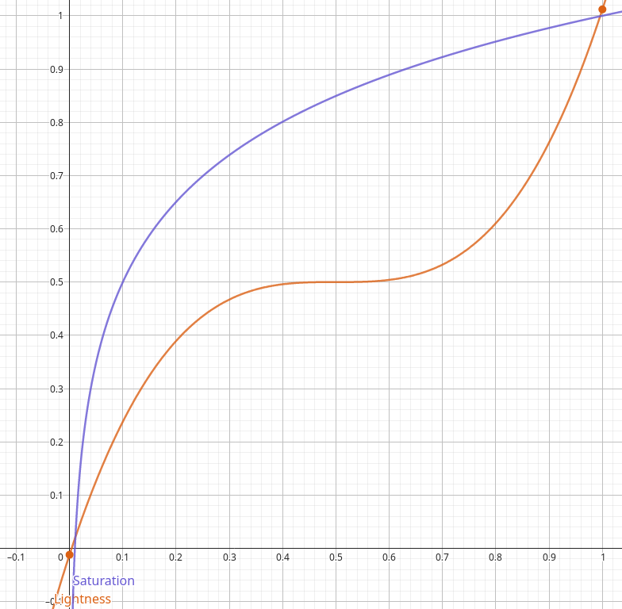

# Arduino-rgb-controller
## Installazione
> [!TIP]
> Utilizza l'ultima versione dell'aruino ide per compilare lo sketch.
### Metodo 1
* Clona la repo con git `git clone https://github.com/L0r3nz0000/Arduino-rgb-controller`
* Spostati nella cartella `cd Arduino-rgb-controller`
* Compila e carica lo sketch sulla tua scheda usando il framework arduino
* Modifica i permessi sul file `chmod +x install.sh`
* Esegui lo script di installazione con `sudo ./install.sh`
### Metodo 2
Installazione con un solo comando
```bash
git clone https://github.com/L0r3nz0000/Arduino-rgb-controller && cd Arduino-rgb-controller && sudo ./install.sh
```
## Circuito
</img>
## Come funziona?
Questo progetto è diviso in due componenti principali: il service installato nel computer e lo sketch sulla scheda.
Il programma sul computer cattura le immagini presenti sullo schermo per poi abbassarne la qualità (per motivi di prestazioni) e calcola il colore medio presente nell'immagine catturata, poi viene applicato un filtro che ne modifica saturazione e luminosità per poi inviare alla scheda il colore risultante, a questo punto l'arduino utilizza 3 pin pwm per creare un'uscita analogica su cui si può collagare un qualsiasi led rgb.
## Il filtro
Per rendere i colori dei led più vividi ho utilizzato due funzioni, una per la luminosità e una per la saturazione.
per fare questo ho convertito i colori dal formato rgb ad [hsl](https://en.wikipedia.org/wiki/HSL_and_HSV) per poter modificare lightness e saturation.
### I grafici delle funzioni che ho utilizzato sono salvati su Desmos a questo [link](https://www.desmos.com/calculator/zch9y48nqb)
</img>
